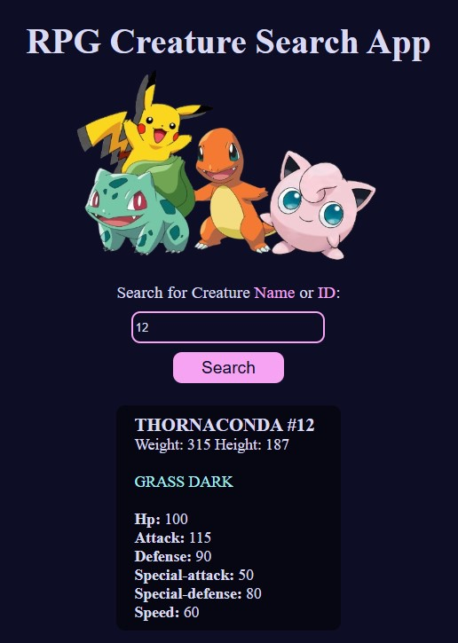

# RPG Creature Search App

A simple front-end web application that functions as a Pokédex. Users can search for a Pokémon by its name or ID to retrieve its stats, type, and other information.

This project was built as part of the **JavaScript Algorithms and Data Structures** certification curriculum from [freeCodeCamp](https://www.freecodecamp.org/).

**Live Demo:** [**https://mari3l-p.github.io/RPG-creature-search**](https://mari3l-p.github.io/RPG-creature-search)
*(Replace this link with your own GitHub Pages URL)*



---

## 🚀 Features

* **Search by Name:** Find a Pokémon by typing its name (e.g., "Pikachu").
* **Search by ID:** Find a Pokémon by typing its numerical ID (e.g., "25").
* **Dynamic Results:** The app fetches data and dynamically updates the UI to display:
    * Name and ID
    * Weight and Height
    * Types (e.g., "Grass", "Dark")
    * Base Stats (HP, Attack, Defense, Special Attack, Special Defense, Speed)
* **Error Handling:** Displays a "Not Found" message if the Pokémon doesn't exist.
* **Responsive Design:** The layout is functional on both desktop and mobile devices.

---

## 🛠️ Technologies Used

* **HTML5:** For the basic structure of the app.
* **CSS3:** For styling, layout, and responsiveness.
* **JavaScript (ES6+):** For the application logic, DOM manipulation, and fetching data.
* **Fetch API:** To make asynchronous requests to the Pokémon data source.

---

## 🏁 How to Use

This is a static front-end project. No complex installation is required.

### Option 1: View the Live Demo

You can view the live project hosted on GitHub Pages (or your preferred hosting service) at the link provided above.

### Option 2: Run Locally

1.  **Clone the repository:**
    ```sh
    git clone [https://github.com/mari3l-p/RPG-creature-search](https://github.com/mari3l-p/RPG-creature-search)
    ```

2.  **Navigate to the project directory:**
    ```sh
    cd your-repo-name
    ```

3.  **Open the `index.html` file:**
    Simply open the `index.html` file in your favorite web browser (like Chrome, Firefox, or Safari) to run the application.

---

## 🙏 Acknowledgements

* This project was completed as a requirement for the [freeCodeCamp JavaScript Algorithms and Data Structures Certification](https://www.freecodecamp.org/learn/javascript-algorithms-and-data-structures-v8/build-a-pokemon-search-app-project/build-a-pokemon-search-app).
* All Pokémon data is retrieved from the [PokéAPI](https://pokeapi.co/).#